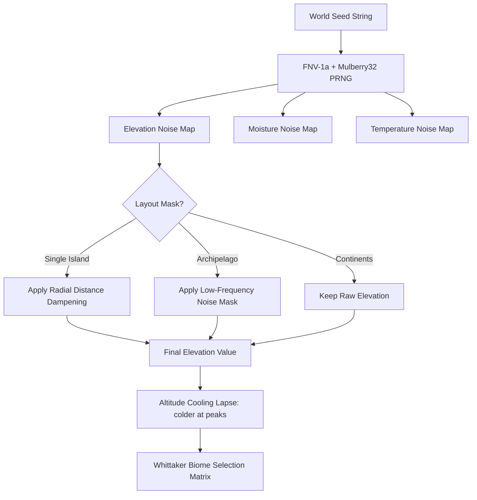
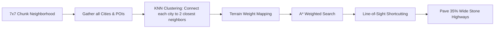
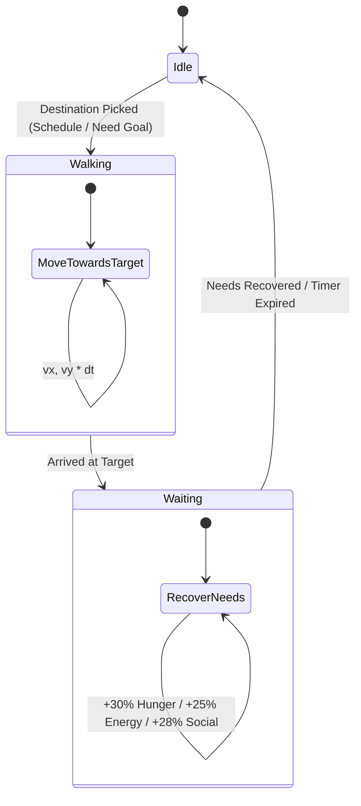

# 🌍 Procedural World Map & Sandbox Simulator

Welcome to the **Procedural World** reference documentation. This project is a state-of-the-art, high-performance web application that procedurally generates vast, infinite 2D fantasy worlds and allows developers and players to dive into interactive, real-time chunk sandboxes with live NPC ecosystems.

This repository serves as a showcase of advanced procedural generation algorithms, WebGL rendering via PixiJS, real-time physics loops, customized audio synthesis, and autonomous agent behaviors.

---

## 🚀 Key Features

* **Infinite Procedural World Map**: Dynamically generated continents, island chains, and archipelagos powered by multi-octave Simplex noise.
* **Whittaker-Style Biome Matrix**: Realistic biome placement (Deep Ocean, Shallow Water, Sandy Beaches, Grasslands, Forests, Deserts, Mountain Ranges, Snowy Peaks) dynamically adjusted by altitude temperature cooling.
* **Complex Hydrology Modeling**: Real-time river carving via downhill-gated channel widening and low-elevation lake basins with moisture enrichment for lush riverbanks (riparian zones).
* **Deterministic Settlement Spawning**: Intelligent city-building featuring a fortress keep/city center, scattered homes with a spacing-distribution algorithm, local road connectivity, and specialized functional districts (Residential, Commercial, Industrial, Military).
* **Global Highway Network**: Infinite cross-chunk roads computed dynamically using K-Nearest Neighbors (KNN) clustering, terrain-weighted A* pathfinding (bridges over rivers, ocean avoidance), and path smoothing via line-of-sight shortcutting.
* **Fully Furnished Procedural Interiors**: Click any city center, house, or ruins to inspect seed-stable, custom-named, room-by-room grid layouts equipped with district-specific furniture (e.g., royal gold thrones, steel blast forges, merchant counters).
* **Interactive Chunk Sandbox Mode**: Zoom into a 16x16 sub-grid creative mode to paint tiles, plant forests, carve water, pave roads, spawn citizens, or summon lightning strikes that burn earth and evaporate citizens with screen-shake animations.
* **Autonomous Citizen NPC Simulation**: Live citizens with specialized roles (Farmers, Workers, Explorers) possessing a 4-need decay system (Hunger, Energy, Social, and Goal overrides) and real-time schedules (work in the day, socialize in the evening at taverns/campfires, sleep at night in cottages).
* **Synthesized Sound FX Engine**: Immersive sound effects synthesized in real-time on-the-fly using the browser's native **HTML5 Web Audio API** (sine, triangle, and sawtooth oscillators).
* **Rich Aesthetics**: Glassmorphism HUD overlays, dark-mode styling, animated tree sways, swimming fish, smoking chimneys, pulsing neon obelisks, and real-time lighting transitions (Day, Sunset, Night).

---

## 🛠️ Technology Stack & Architecture

The application is built with a decoupled, high-performance frontend architecture:

| Layer | Technology | Purpose |
| :--- | :--- | :--- |
| **Core Framework** | React 19 (TypeScript) | Reactive UI components, HUD overlays, state integration. |
| **Styling** | TailwindCSS v4 | Sleek modern aesthetics, dark mode, glassmorphism panel interfaces, and fluid micro-animations. |
| **High-Performance Renderer** | PixiJS v8 (WebGL/WebGPU) | Renders the infinite world map at 60fps utilizing offscreen canvas caching and viewport frustum culling. |
| **State Management** | Zustand | Lightweight, high-performance global store for configuring seeds, noise parameters, and sandbox states. |
| **Math & Noise Core** | `simplex-noise` | Underlying mathematical noise maps for generating elevation, moisture, and temperature. |

---

## 📂 Directory Structure

```filepath
procedural-world/
├── src/
│   ├── app/
│   │   └── store/
│   │       └── useWorldStore.ts         # Global Zustand state, presets, and visualization configurations.
│   ├── core/
│   │   ├── engine/
│   │   │   └── ViewportController.ts    # PixiJS pan, zoom, click-drag, and velocity damping.
│   │   ├── renderer/
│   │   │   └── .gitkeep                 # Pixi graphics abstractions container.
│   │   └── world/
│   │       ├── resources.ts             # Deterministic item lists and rarities mapped by biome.
│   │       └── terrain.ts               # Whittaker Biome Matrix and PixiJS/CSS color configurations.
│   ├── features/
│   │   ├── export/
│   │   │   └── .gitkeep                 # Future map saving and JSON serializations.
│   │   ├── generation/
│   │   │   ├── interiorGenerator.ts     # Seed-stable procedural building interior and furniture layout engine.
│   │   │   ├── roadGenerator.ts         # Global A* highway router, KNN-clustering, and LOS smoothing.
│   │   │   ├── settlementGenerator.ts   # Suitability scoring, Keep placements, and house spacing algorithms.
│   │   │   └── terrainGenerator.ts      # Multi-octave Simplex noise generator, river/lake carving, and island masks.
│   │   ├── map/
│   │   │   ├── TileInspector.tsx        # HUD displaying hovered tile parameters and biome resource nodes.
│   │   │   └── WorldCanvas.tsx          # Main PixiJS application; orchestrates viewport culling, tile rendering, and roads.
│   │   ├── sandbox/
│   │   │   └── ChunkSandboxView.tsx     # The interactive 16x16 chunk sandbox, NPC physics, Web Audio synthesizer, and tools.
│   │   └── ui/
│   │       └── .gitkeep                 # Layout and control widgets.
│   ├── App.tsx                          # Primary entry-point, main dashboard layout, sliders, and presets.
│   ├── index.css                        # Global Tailwind styles and custom keyframe animations.
│   └── main.tsx                         # React root element mounter.
└── package.json                         # Dependencies and build script specifications.
```

---

## 🧠 System Architecture & Algorithms

### 1. Pseudo-Random Number Generation (PRNG)
Since Javascript's default `Math.random()` cannot be seeded, the engine employs a deterministic **FNV-1a hashing function** paired with a **Mulberry32 LCG-like generator**. This guarantees that given the same string seed, the entire world (including all NPC positions, names, highway routes, and building interiors) generates identically every single time.
```typescript
export function getSeededRandom(seedStr: string) {
  let h = 2166136261 >>> 0;
  for (let i = 0; i < seedStr.length; i++) {
    h = Math.imul(h ^ seedStr.charCodeAt(i), 16777619);
  }
  return function() {
    h = (h + 0x6D2B79F5) | 0;
    let t = Math.imul(h ^ (h >>> 15), h | 1);
    t ^= t + Math.imul(t ^ (t >>> 7), t | 61);
    return ((t ^ (t >>> 14)) >>> 0) / 4294967296;
  };
}
```

### 2. Multi-Octave Noise & Layout Masking
The terrain generator blends several octaves of Simplex noise together (controlling frequency scales, persistence amplitudes, and lacunarity details) to generate three primary maps: **Elevation**, **Moisture**, and **Temperature**.
To control the shape of the landmass, a custom layout mask is applied to the elevation:
* **Continents**: Raw, unmasked, endless noise.
* **Single Island**: Scales down elevation exponentially based on the distance from the center coordinate `(0,0)` using a power curve:
  $$\text{Elevation} = \text{Elevation} \times \left(1 - \left(\frac{\text{Distance}}{\text{IslandRadius}}\right)^{2.5}\right)$$
* **Archipelago**: Multiplies the elevation by a secondary, low-frequency Simplex noise mask, creating detached clusters of islands.



### 3. Whittaker-Style Biome Matrix
Once elevation, moisture, and temperature are calculated, the engine runs them through a custom **Whittaker Biome Matrix** located in `src/core/world/terrain.ts`.
* Elevation below `0.22` maps to **Deep Water**.
* Elevation below `0.38` maps to **Shallow Water**.
* Elevation below `0.43` maps to **Sandy Beach**.
* Elevation above `0.80` maps to **Snowy Peaks** if freezing (temperature < 0.40) or **Mountains** if warmer.
* Mid-level land biomes are partitioned based on climate rules:
  * **Moisture < 0.35 & Temperature > 0.65** $\rightarrow$ **Desert**
  * **Moisture > 0.55** $\rightarrow$ **Forest**
  * **Fallback** $\rightarrow$ **Grasslands**

> [!TIP]
> **Altitude Temperature Cooling**: The engine implements a realistic physical lapse rate. For every unit of elevation above the sandy beaches (> 0.43), the local temperature decays proportionally: `temperature = Math.max(0, temperature - (elevation - 0.43) * 0.6)`. This guarantees that high mountain ranges naturally form beautiful snowcaps!

---

## 🌊 Advanced Water Simulation

Instead of drawing randomized blue squiggles, the hydrology engine carves physical water systems:

```
[Lake Basin Generation]
High Lake Noise (lVal > 0.64) + Low-to-Mid Elevations
 └── Basin is flattened at Elevation = 0.34
 └── Terrain type is set to "river" (Freshwater Lake)
 
[River Channel Carving]
Narrow corridor along River Noise (Math.abs(rVal) < tRiver) + Elevation >= 0.38
 └── Downhill Gating: tRiver scales down at high peaks, creating wider channels in valleys
 └── Elevation is hollowed out: 0.32 + 0.04 * (rVal / tRiver)^2 (forming a U-shaped channel)
 └── Terrain type is set to "river" (Freshwater River)
```

> [!NOTE]
> **Moisture Enrichment (Riparian Zones)**: Water bodies dynamically affect surrounding environments. Soil tiles situated immediately adjacent to rivers and lakes receive a massive moisture boost of up to `+0.40` in a gradient fallout, transforming arid surrounding areas into lush grasslands and dense green forests.

---

## 🏘️ Settlement & City Spawning

Each chunk runs a deterministic spawning algorithm:
1. **Spawning Chance**: The PRNG determines if a chunk holds a settlement (20% chance). If it fails, there is a 6% chance it spawns a standalone Point of Interest (POI) such as a *cottage*, *campfire*, *mystic obelisk*, or *ancient ruins*.
2. **Suitability Matrix**:
   * Scans all tiles in the chunk.
   * Water, mountains, and snowy peaks are completely ineligible.
   * Flat, fertile land (grass/forest biomes at low elevation) starts with `+10` points.
   * Runs a 5x5 neighborhood scanner. The proximity of any adjacent water body grants a bonus of `+3` for direct contact and `+1` for distant contact.
3. **Establishment Gate**: If fewer than 4 eligible tiles exist in the chunk, the settlement fails to spawn to prevent isolated buildings.
4. **The Fortress Keep (City Center)**: The tile with the highest suitability score closest to the exact center of the 16x16 chunk is designated as the **City Center**.
5. **House Scattering (Spacing Check)**: Spawns 3 to 7 houses within a Manhattan distance of 2 to 4 from the City Center. To prevent clustered blocks, the engine runs a spacing search: each new house is placed on the candidate tile that maximizes the distance from all already placed houses.
6. **Local Street Network**: Paves gravel/stone roads connecting each house back to the City Center using a clean L-shaped pathing vector.

---

## 🛣️ Global highway Networks

To bind distant cities together into a unified kingdom, the `roadGenerator.ts` executes a dynamic pathfinding pipeline:



* **Terrain Weights**: A* calculates movements based on terrain resistance:
  * **Grass**: 1.0 (Ideal) | **Forest/Beach**: 2.0 | **Desert**: 5.0 | **Mountain**: 8.0 | **Snow**: 12.0
  * **River**: 15.0 (High cost $\rightarrow$ forces the pathfinder to draw straight crossings, forming bridges over water!)
  * **Ocean / Deep Water**: 250.0 (Strictly avoided unless no other route exists).
* **Line-of-Sight (LOS) Smoothing**: Raw A* outputs jagged, blocky paths. The smoothing algorithm scans ahead up to 10 nodes at a time. If a straight Bresenham line between node $A$ and node $B$ is clear of oceans and steep mountain cliffs, it shortcuts the path, smoothing out jagged corners into natural diagonals.

---

## 🏠 Procedural Building Interiors

Clicking on any city center, house, or POI on the map transitions the player into a seed-stable interior viewport. 

```
[Structure Type]  ---> Size Choice (City Center: 8x8, House/POI: 6x6)
[District Type]    ---> Floor Choice (Military/Industrial: Stone, Residential/Commercial: Wood Planks)
                   ---> Custom Procedural Names ("Eldoria Cozy Command Bastion", "Rustic Oak Smithy")
                   ---> Custom Smells ("coal, ash, and heated metal", "spices and old parchment")
```

### Furniture Placement Vectors (Matrix Coordinates)
* **Residential**: Straw-frame beds, stone fireplaces, oak trestle dining tables with matching spindle chairs, cedar travel chests, and colorful woolen rugs.
* **Commercial**: Polished high-top mahogany merchant counters arranged in L-shapes, ledger desks, shopkeeper stools, potion display shelves, and heavy iron cash vaults.
* **Industrial**: Heavy brick blast forges, steel anvils, iron ore storage crates, wood coal bins, and stone quenching troughs.
* **Military (Grand Throne Room)**: A majestic high-backed golden throne, crimson velvet carpets leading to the dais, Limestone war shields, iron guard candelabras, and a tactical war council table complete with map scroll markings.

---

## 🎮 Interactive Sandbox & NPC Agent Simulation

The core feature of the application is the **Chunk Sandbox View** (`src/features/sandbox/ChunkSandboxView.tsx`), which provides a complete real-time 16x16 micro-world simulation.

### 1. Real-Time Citizen AI & Needs Systems
Each citizen has a dedicated state machine running on a `requestAnimationFrame` tick. They are governed by a **4-Need Decay Matrix** updated via delta-time:
* **Decay Rates**: Hunger decays by `-1.6/sec`, Social by `-1.4/sec`, and Energy decays by `-1.2/sec` (boosted to `-1.8/sec` when actively working).
* **Time-of-Day Schedules**:
  * **☀️ Day (Work Mode)**: Citizens navigate to their designated work site (e.g., Farmers tend to wheat crops, Workers chop forests or mine mountains, Explorers decode obelisks/explore ruins).
  * **🌅 Sunset (Social Mode)**: Citizens head to campfires or taverns to drink cider, chat, and relax.
  * **🌙 Night (Sleep Mode)**: Citizens head to their cottages or homes to rest.
* **Goal Override (Urgent Needs)**:
  * If **Hunger $\le$ 30%**: The citizen abandons work/sleep, sets their goal to `food`, searches the sandbox for a farm or tavern, eats, and restores hunger.
  * If **Energy $\le$ 30%**: Sets goal to `sleep` and returns home.
  * If **Social $\le$ 30%**: Sets goal to `socialize` and walks to a tavern or campfire.
  * Needs must be restored to **$\ge$ 95%** before the citizen resumes their standard schedule!



### 2. Live Speech-Bubble Thoughts
NPCs display active, real-time thought bubbles above their heads depending on their status, roles, and current location:
* *Eating hot stew at the tavern... 🍲*
* *Tending to the golden wheat crops... 🌾*
* *Felling trees and gathering timber... 🪓*
* *Zzz... sleeping deeply... 🛌*
* *Decoding glowing cyan obelisk runes... 🔮*
* *So hungry! Searching for food... 🥣*

### 3. Synthesized Web Audio Engine
The sandbox uses the HTML5 **Web Audio API** to generate sound effects mathematically from raw wave inputs, avoiding sluggish external asset downloads:
* **Tool Select (Beep)**: A high-pitched, clean sine wave at `580Hz` ramping down rapidly in `0.12s` (`sine`).
* **Build / Edit (Pop)**: A medium pitch `350Hz` triangle wave sliding exponentially down to `80Hz` in `0.18s` to create a fleshy thud (`triangle`).
* **Spawn Citizen (Chime)**: A beautiful two-note arpeggio chord (G5 at `784Hz` transitioning to C6 at `1046.5Hz`) over `0.35s` (`sine`).
* **Lightning Strike (Rumble)**: A low-pitched `110Hz` sawtooth wave sliding down to `45Hz` in `0.70s` accompanied by a custom tremolo LFO volume modulator to simulate thunderous cracking (`sawtooth`).

### 4. Interactive Sandbox Creative Tools
The editor panel allows players to dynamically modify the chunk:
* **Plant Forest (`🌲`)**: Paints a dense forest tile.
* **Build Cottage (`🏡`)**: Spawns a cottage structure.
* **Cozy Tavern (`🍺`)**: Spawns a functional tavern.
* **Wheat Farm (`🌾`)**: Spawns a farm.
* **Campfire (`🔥`)**: Places a campfire.
* **Pave Road (`🛣️`)**: Lays local cobblestone roads.
* **Carve Water (`🌊`)**: Digs a freshwater stream.
* **Spawn Citizen (`🧑‍🌾`)**: Spawns a new autonomous NPC.
* **Bulldoze (`🧹`)**: Clears structures, roads, and resets the biome.
* **Lightning Strike (`⚡`)**: Strikes the grid.
  * *Visual*: A bright flash of white over the entire viewport with an `animate-shake` screen shake.
  * *Physics*: Targeted tile and its 8 adjacent neighbors are instantly scorched into dry desert sand; all structures, roads, and trees are incinerated.
  * *Ecosystem*: Any citizens trapped in the $3\times3$ blast radius are instantly vaporized!

---

## ⚡ Quick Start: Running Locally

Follow these steps to spin up the development server and run the procedural engine locally:

### 1. Prerequisites
Ensure you have **Node.js** (v18 or higher) and **npm** installed.

### 2. Installation
Clone this repository to your local drive, open a terminal in the root directory, and install dependencies:
```bash
npm install
```

### 3. Running Dev Server
Launch Vite's high-speed hot-module-replacement (HMR) development server:
```bash
npm run dev
```
The application will spin up instantly. Open your browser and navigate to the local address (typically `http://localhost:5173`).

### 4. Building for Production
To build a highly optimized production bundle:
```bash
npm run build
```
This runs TypeScript compilations (`tsc`) and compiles static bundles under the `/dist` directory.

---

## 🗺️ Developer Roadmap: Extending the Codebase

For future developers picking up this codebase, here are the recommended next execution steps:

### Phase 1: Local Settlement Building Toggles
Add checkboxes in the sidebar to manually place major settlements on the map or adjust the settlement spawn chance coefficient (currently locked at 20%).

### Phase 2: Autonomous NPC Navigation on Highways
Extend the Sandbox NPC navigation to travel across chunks. When an NPC's schedule demands *Exploring*, they should walk out of the 16x16 sandbox grid, locate the global highway, and physically walk along the road lines to neighboring chunks.

### Phase 3: Trade & Economy Simulation
Assign inventory systems to NPCs and structures. Wheat harvested from Farms should be carried by Farmers to Taverns or City Centers, where they can trade for iron ore mined from Mountains, simulating a live supply chain.
